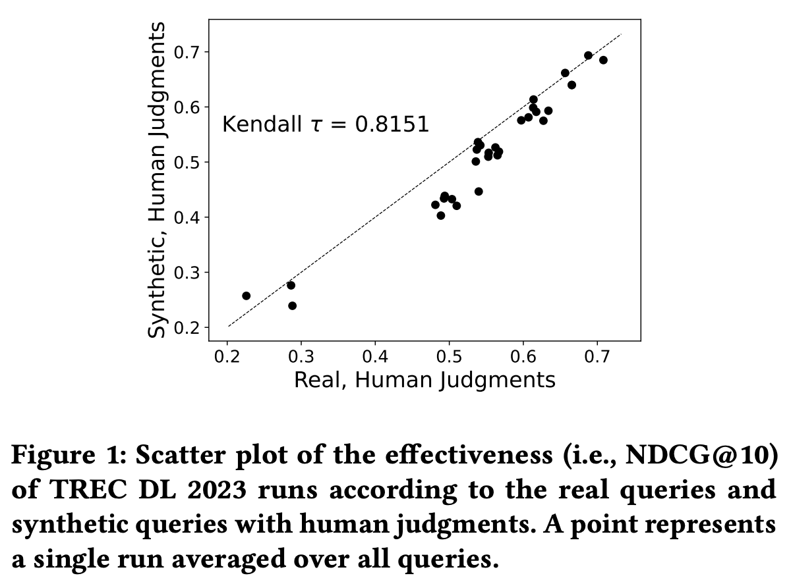

# Synthetic Test Collection
Synthetic Test Collections for Retrieval Evaluation (SIGIR 2024)

<div align="center">

  [](https://arxiv.org/pdf/2405.07767)
  [](https://pytorch.org/)
  [](https://opensource.org/licenses/MIT)
</div>

## Overview
<p align="center">
  
</a>
<br />

### Abstract
Test collections play a vital role in evaluation of information retrieval (IR) systems. Obtaining a diverse set of user queries for test collection construction can be challenging, and acquiring relevance judgments, which indicate the appropriateness of retrieved documents to a query, is often costly and resource-intensive. Generating synthetic datasets using Large Language Models (LLMs) has recently gained significant attention in various applications. In IR, while previous work exploited the capabilities of LLMs to generate synthetic queries or documents to augment training data and improve the performance of ranking models, using LLMs for constructing synthetic test collections is relatively unexplored. Previous studies demonstrate that LLMs have the potential to generate synthetic relevance judgments for use in the evaluation of IR systems. In this paper, we comprehensively investigate whether it is possible to use LLMs to construct fully synthetic test collections by generating not only synthetic judgments but also synthetic queries. In particular, we analyse whether it is possible to construct reliable synthetic test collections and the potential risks of bias such test collections may exhibit towards LLM-based models. Our experiments indicate that using LLMs it is possible to construct synthetic test collections that can reliably be used for retrieval evaluation.

## Folders and Files
- __dl-2023-runs__: includes the run submissions for TREC Deep Learning Track 2023
- __2023_queries.tsv__: TREC Deep Learning track 2023 test queries
- __2023.qrels.pass.withDupes.txt__: TREC Deep Learning track 2023 passage qrels -- judged by NIST assessors
- __2023.qrels.pass.gpt4.txt__: TREC Deep Learning track 2023 passage qrels -- judged by GPT-4
- __prompts__: includes the prompts for different tasks, passage quality rater, query generation
-
-

### TREC Deep Learning 2023 Passages
The TREC Deep Learning 2023 Passages can be downloaded form the following URL: <a href="https://msmarco.z22.web.core.windows.net/msmarcoranking/msmarco_v2_passage.tar" target="_blank">msmarco_v2_passage.tar</a>

## Test Query
- `qid in the 2M range`: These are the human/real queries for TREC Deep Learning track 2023
- `qid in the 3M range`: These are the synthetic queries for TREC Deep Learning track 2023
- `qid < 3.1M`: These are 250 **T5**-generated queries
- `qid > 3.1M`: These are 250 **GPT4**-generated queries

## Synthetic Queries

### T5

- BeIR codes

### GPT-4

- prompt

## Synthetic Judgments

- prompt

- `engine = gpt-4-32k`
- `temperature = 0`
- `top_p = 1`
- `frequency_penalty = 0.5`
- `presence_penalty = 0`

## Runs (ndcgeval, treceval)

- command

## Metadata Files

- files

## Cite
```
@inproceedings{rahmani2024synthetic,
  title={Synthetic Test Collections for Retrieval Evaluation},
  author={Rahmani, Hossein A and Craswell, Nick and Yilmaz, Emine and Mitra, Bhaskar and Campos, Daniel},
  booktitle={Proceedings of the 47th International ACM SIGIR Conference on Research and Development in Information Retrieval},
  pages={2647--2651},
  year={2024}
}
```

```
@inproceedings{craswell2024overview,
author = {Craswell, Nick and Mitra, Bhaskar and Yilmaz, Emine and Rahmani, Hossein A. and Campos, Daniel and Lin, Jimmy and Voorhees, Ellen M. and Soboroff, Ian},
title = {Overview of the TREC 2023 Deep Learning Track},
organization = {NIST},
booktitle = {Text REtrieval Conference (TREC)},
year = {2024},
month = {February},
publisher = {TREC},
url = {https://www.microsoft.com/en-us/research/publication/overview-of-the-trec-2023-deep-learning-track/},
}
```

## Acknowledgments
- This research is supported by the Engineering and Physical Sciences Research Council [EP/S021566/1] and the EPSRC Fellowship titled “Task Based Information Retrieval” [EP/P024289/1].
- <a href="https://microsoft.github.io/msmarco/TREC-Deep-Learning.html" target="_blank">TREC 2023 Deep Learning Track Guidelines</a>